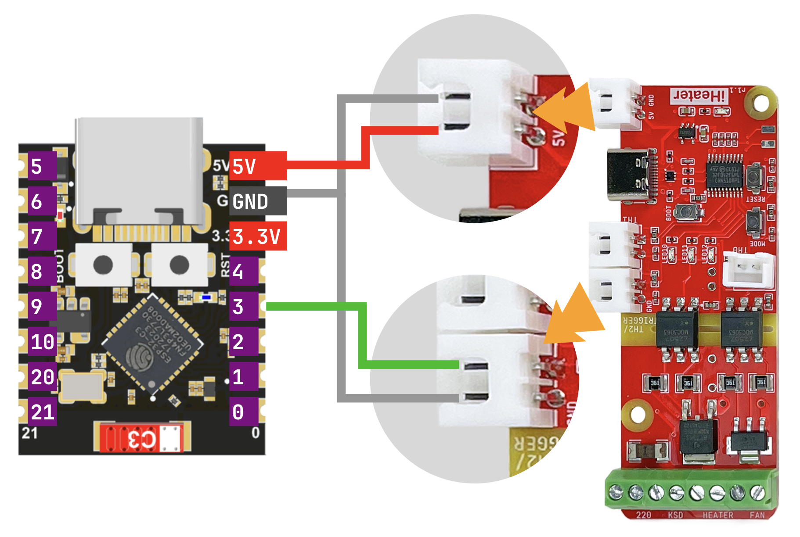

# iHeater Link — краткое руководство

iHeater Link — модуль связи для контроллера **iHeater** с прошивкой [iheater_revХ_Х_pulse](https://github.com/pavluchenkor/iHeater-Standalone-Firmware/releases). Это плата на ESP32-C3 / ESP32-S3, которая:

- Подключается к Wi-Fi и связывает iHeater с [portal.idryer.org](https://portal.idryer.org/).
- Получает целевую температуру камеры от принтера через
  интеграции **Moonraker (Klipper)**, **Bambu Lab (LAN)** или
  **Home Assistant**.
- Преобразует целевую температуру в импульсный сигнал и передаёт его контроллеру iHeater на одном GPIO.

Управление iHeater идёт «по проводу»: один сигнальный пин ESP → сигнальный вход iHeater. Wi-Fi и интеграции — забота Link, нагрев и безопасность — забота iHeater.

Однопроводное соединение не накладывает ограничений на размещение Link. Плату ESP можно вынести за пределы термокамеры. Это исключает:

- перегрев чипа и периферии при работе камеры на 60+ °C;
- термические зависания радиосекции и срыв Wi-Fi-сессии при длительном нагреве;
- ускоренную деградацию.

Внутри камеры остаётся только iHeater, рассчитанный на работу при высоких температурах. Длина сигнального провода до ESP ограничена только разумной нагрузкой на линию (десятки сантиметров — без оговорок).

## Поддерживаемые платы

| Плата                        |       |
| ---------------------------- | ----- |
| ESP32-C3 Super Mini          | `✅`  |
| ESP32-C3 DevKitM-1           | `✅`  |
| Seeed XIAO ESP32-S3          | `✅`  |
| Waveshare ESP32-S3-Zero      | `✅`  |

Любую другую плату на ESP32-C3 или ESP32-S3 можно использовать, если
есть свободный GPIO для сигнального выхода. Сверяйтесь с пинаутом
производителя.

## Схема подключения

!!! warning "Никогда не подключайте и не отключайте провода при поданном питании."

Питание подаётся на ESP через USB-C. ESP, в свою очередь, питает контроллер iHeater по линии 5 V. Это самый простой вариант. При необходимости питание iHeater можно организовать иначе — связь с Link не зависит от схемы питания.

Соединения (для всех поддерживаемых плат):

| ESP        | iHeater          | Назначение            |
| ---------- | ---------------- | --------------------- |
| `5V`       | `5V`             | питание контроллера   |
| `GND`      | `GND`            | общая земля           |
| `GPIO3`    | сигнальный вход  | импульсный setpoint   |

### Пинаут плат

ESP32-C3 Super Mini:

Waveshare ESP32-S3-Zero:

## Прошивка через веб-флешер

Веб-флешер находится на [install.idryer.org](https://install.idryer.org/).

1. Подключите Link к USB-порту компьютера.
2. Откройте [install.idryer.org](https://install.idryer.org/) и выберите устройство **iHeater Link**.
3. Выберите вариант платы.
4. Нажмите **Connect**, выберите серийный порт (обычно `USB JTAG/serial`
   или `CH340`). Если устройство не определяется, зажмите кнопку `BOOT`
   на плате и кратко нажмите `RST`.
5. Нажмите **Install**. Флешер запишет прошивку.
6. По завершении прошивки откроется мастер настройки Wi-Fi.

## Настройка Wi-Fi

После прошивки в Serial-порт автоматически открывается Improv-мастер.

1. Введите SSID и пароль вашей сети 2,4 ГГц.
2. Дождитесь статуса **Connected**. Indicate-индикатор Link перейдёт в
   режим «дыхания» голубым.

Если мастер не открылся, отключите USB и подключите снова через
**Connect** без повторной прошивки.

!!! note "ESP32 поддерживает только 2,4 ГГц. Сети 5 ГГц не работают."

## Привязка к порталу

1. На странице флешера нажмите **Подключить и выполнить Claim**.
2. На устройство уйдёт команда `START_CLAIM`. Через несколько секунд
   на странице появится PIN. PIN действует ~5 минут.
3. Откройте [portal.idryer.org](https://portal.idryer.org/) → **Добавить
   устройство** → введите PIN.
4. После успешной привязки устройство появится в списке онлайн.

Если в ответ пришло `CLAIM_ALREADY:DEVICE_…` — устройство уже привязано к этому или другому аккаунту. В этом случае удалите устройство в портале и повторите привязку.

## Подключение к iHeater

1. Отключите питание контроллера.
2. Подключите ESP к iHeater по схеме выше: `5V`, `GND`, `GPIO3` →
   сигнальный вход iHeater.
3. Подайте питание на USB ESP. Контроллер запитается через линию 5 V.

После загрузки Link установит соединение с порталом, активирует
выбранную интеграцию и начнёт передавать целевую температуру
камеры на iHeater.

## Что должно получиться

- Светодиод 1 светит постоянно, светодиод 3 коротко мигает 1 раз в секунду, это сигнализирует о наличии связи iHeater Link - iHeater.
- при потере связи все светодиоды мигают с частотой 1 гц.
- остальные ошибки на связаны с iHeater Link и повторяют индикацию standalone прошивки.

## Диагностика

В меню устройства есть пункт **DIAGNOSTICS → DIAG LOG**. При его включении в Serial раз в секунду выводится подробный отчёт: статус Wi-Fi, MQTT, активная интеграция, текущий target, ошибки коннекторов.

Подробности по диагностике — в
[`lib/idryer-core/docs/ru/10-troubleshooting.md`](../lib/idryer-core/docs/ru/10-troubleshooting.md).

