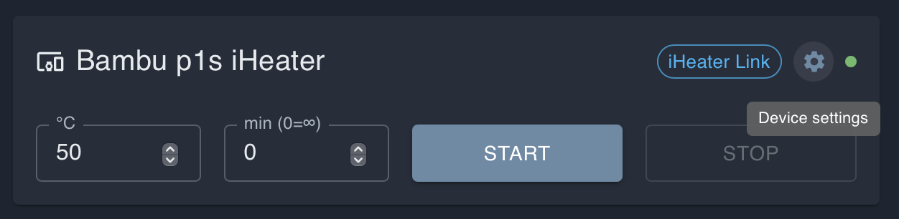
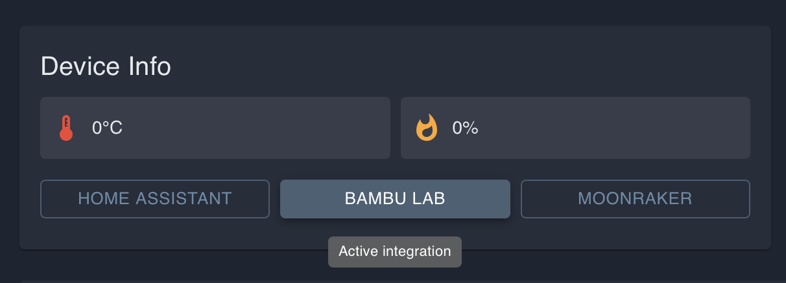
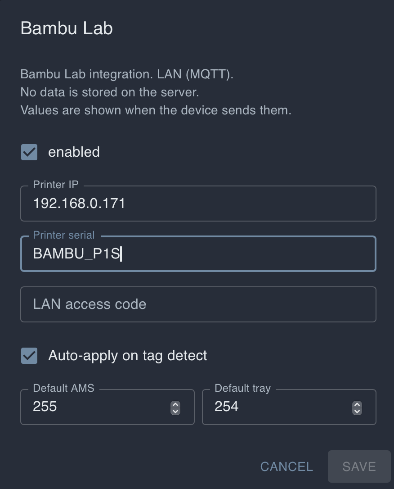
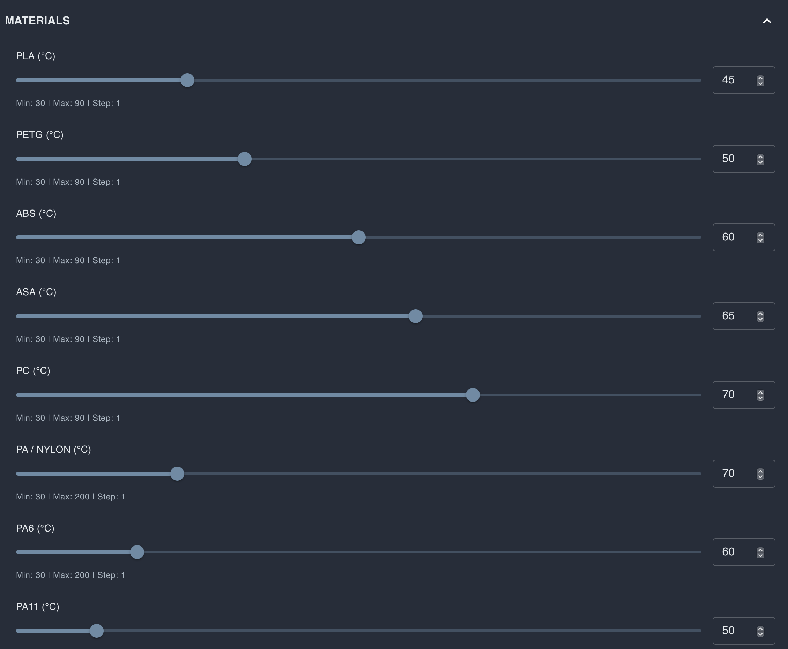

# Настройка Bambu Lab для iHeater Link

## Для чего это нужно

iHeater Link может автоматически управлять iHeater во время печати на принтерах Bambu Lab. В отличие от Klipper-сценария, на принтер Bambu не нужно добавлять макросы или изменять G-code. Link подключается к принтеру по локальной сети и читает состояние печати и активный филамент.

На текущих принтерах Bambu Lab нельзя надёжно использовать передачу температуры камеры как команду управления iHeater. Зато Link может определить, какой филамент сейчас установлен в активном трее и что принтер начал подготовку к печати или уже печатает. На основе типа филамента прошивка выбирает нужную температуру камеры из таблицы материалов и автоматически включает iHeater.

Если нужного типа филамента нет в списке материалов прошивки, напишите автору прошивки: тип можно добавить в следующих версиях.

## Что получится

```text
Bambu начинает подготовку или печать -> Link видит активный филамент -> выбирает температуру из таблицы материалов -> iHeater включается
```

Когда печать заканчивается или активный сценарий больше не требует нагрева, Link выключает iHeater.

## 1. Откройте настройки устройства

В портале откройте карточку iHeater Link и нажмите иконку шестерёнки.



## 2. Включите соединение Bambu

В настройках устройства откройте блок **CONNECTIONS** и включите **BAMBU**. Остальные соединения можно оставить выключенными, если они не используются.


## 3. Выберите Bambu Lab на странице устройства

Вернитесь на страницу устройства и нажмите **BAMBU LAB** в блоке **Device Info**. Кнопка станет активной.



## 4. Введите параметры подключения

В настройках **Bambu Lab** включите интеграцию и заполните параметры подключения.



Обычно нужны такие поля:

- Printer IP: IP-адрес принтера в локальной сети;
- Printer serial: серийный номер принтера;
- LAN access code: код доступа LAN mode;
- Auto-apply on tag detect: включено, если Link должен автоматически применять температуру по распознанному филаменту;
- Default AMS и Default tray: можно оставить значения по умолчанию, если не нужно принудительно выбрать конкретный AMS или трей.

Принтер и iHeater Link должны находиться в одной локальной сети. LAN access code и серийный номер берутся из настроек принтера Bambu Lab.

## 5. Настройте температуры материалов

Откройте блок **MATERIALS** в настройках устройства. Для каждого типа филамента можно задать свою температуру камеры.



В прошивке уже есть широкий набор типов филаментов. Когда принтер начнёт подготовку к печати или печать, Link проверит активный трей, определит тип филамента и возьмёт температуру из этой таблицы. Например, для PLA можно оставить низкую температуру или отключить нагрев, для ABS и ASA поставить более высокую температуру.

Если активный филамент не найден в таблице или для него задана неподходящая температура, отредактируйте значение в **MATERIALS** и сохраните настройки.

## 6. Проверьте работу

Запустите печать на Bambu Lab с филаментом, для которого задана температура в **MATERIALS**. Когда принтер перейдёт к подготовке или печати, iHeater Link должен автоматически применить температуру для активного филамента и включить iHeater.

Если нагрев не включается, проверьте:

- включено ли соединение **BAMBU** в настройках устройства;
- выбран ли **BAMBU LAB** в блоке **Device Info**;
- правильно ли указаны IP, serial и LAN access code;
- видит ли принтер активный трей и тип филамента;
- задана ли температура для этого типа филамента в **MATERIALS**.
