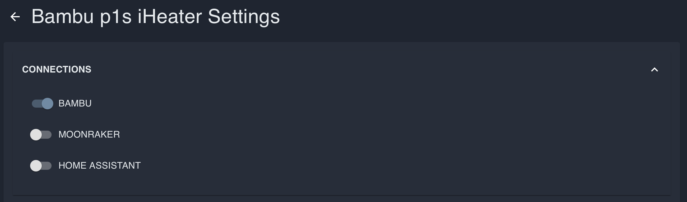

# Bambu Lab setup for iHeater Link

## What this is for

iHeater Link can automatically control iHeater during prints on Bambu Lab printers. Unlike the Klipper setup, Bambu does not require printer-side macros or G-code changes. Link connects to the printer over the local network and reads print state and active filament information.

On current Bambu Lab printers, chamber temperature cannot be used reliably as the control command for iHeater. Instead, Link detects which filament is active in the current tray and whether the printer has started print preparation or printing. Based on the filament type, the firmware selects the chamber temperature from the material table and turns iHeater on automatically.

If the filament type you need is missing from the firmware material list, contact the firmware author so it can be added in a future version.

## Result

```text
Bambu starts preparation or printing -> Link sees active filament -> selects temperature from material table -> iHeater turns on
```

When the print ends or the active scenario no longer requires heating, Link turns iHeater off.

## 1. Open device settings

In the portal, open the iHeater Link device card and click the gear icon.


## 2. Enable the Bambu connection

In device settings, open **CONNECTIONS** and enable **BAMBU**. Other connections can stay disabled if you do not use them.



## 3. Select Bambu Lab on the device page

Return to the device page and click **BAMBU LAB** in the **Device Info** block. The button becomes active.


## 4. Enter connection parameters

In **Bambu Lab** settings, enable the integration and fill in the connection parameters.


Usually these fields are required:

- Printer IP: printer IP address on the local network;
- Printer serial: printer serial number;
- LAN access code: LAN mode access code;
- Auto-apply on tag detect: enable this if Link should automatically apply temperature from the detected filament;
- Default AMS and Default tray: leave the defaults unless you need to force a specific AMS or tray.

The printer and iHeater Link must be on the same local network. LAN access code and printer serial are available in the Bambu Lab printer settings.

## 5. Configure material temperatures

Open **MATERIALS** in device settings. Each filament type can have its own chamber temperature.


The firmware already includes a broad set of filament types. When the printer starts preparation or printing, Link checks the active tray, detects the filament type, and uses the temperature from this table. For example, PLA can use a low temperature or no heating, while ABS and ASA can use higher chamber temperatures.

If the active filament is not found in the table or its temperature is not suitable, edit the value in **MATERIALS** and save the settings.

## 6. Test

Start a Bambu Lab print with a filament that has a temperature configured in **MATERIALS**. When the printer enters preparation or printing, iHeater Link should automatically apply the temperature for the active filament and turn iHeater on.

If heating does not start, check:

- **BAMBU** connection is enabled in device settings;
- **BAMBU LAB** is selected in the **Device Info** block;
- IP, serial, and LAN access code are correct;
- the printer reports the active tray and filament type;
- a temperature is configured for this filament type in **MATERIALS**.
