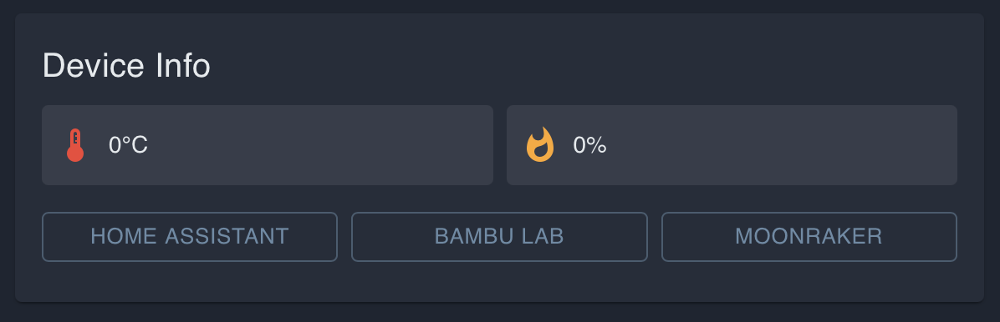
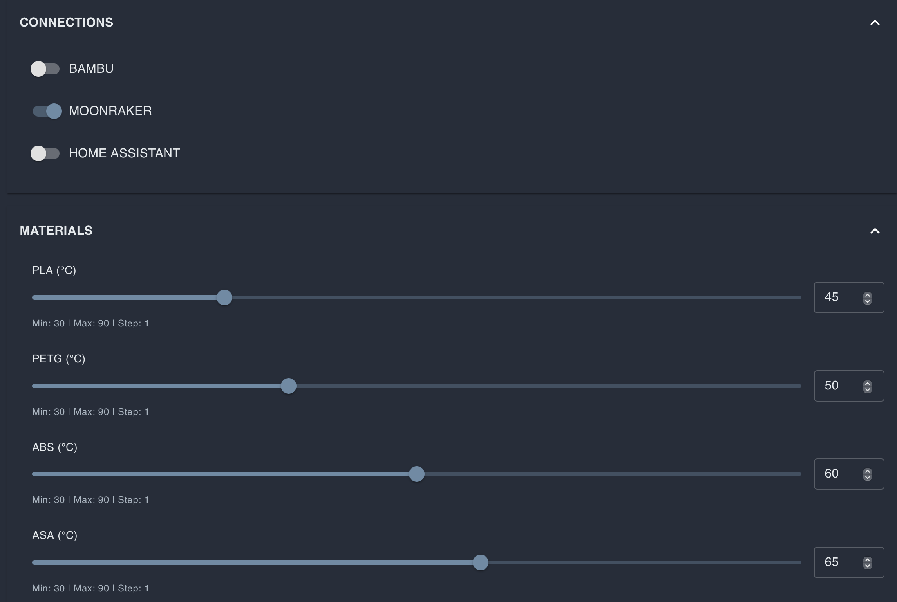
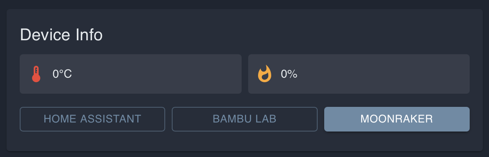

# Klipper setup for iHeater Link

## What this is for

This feature is intended for Klipper-based printers with a locked system: Creality, Qidi, Flashforge, and other modern printers where the user cannot build and install the iHeater firmware for direct Klipper integration.

Regular Klipper configuration files and user G-code macros are often still available. iHeater Link therefore uses a simpler path: it connects to the same Wi-Fi network as the printer, reads variables from a user Klipper macro, and forwards the target temperature to the iHeater controller.

On the printer side, you only add a few G-code macros. They receive standard chamber-temperature commands `M141` and `M191` and store the target in `VIRTUAL_CHAMBER`.

```text
Slicer / G-code -> M141 S50 -> Klipper macro VIRTUAL_CHAMBER.target=50
                                      |
                                      v
Printer on the local network <- Wi-Fi <- iHeater Link -> signal line -> iHeater
```

The user does not need root access or internal printer firmware changes. Access to Klipper user macros is enough.

## Result

```text
M141 S50 -> target = 50 -> iHeater Link turns heating on
M141 S0  -> target = 0  -> iHeater Link turns heating off
```

Many modern printers already have a chamber temperature sensor. If the manufacturer provides such a sensor and it is visible in the Klipper configuration, it can be used to send the actual chamber temperature to the portal and iHeater Link. If there is no sensor, iHeater Link can still control heating from the target temperature.

## 1. Add the macro file

Create `virtual_chamber.cfg` in the Klipper configuration and include it from `printer.cfg`:

```ini
[include virtual_chamber.cfg]
```

Contents of `virtual_chamber.cfg`:

```ini
[gcode_macro VIRTUAL_CHAMBER]
variable_target: 0
variable_temperature: -1
variable_has_sensor: 0
gcode:

[gcode_macro M141]
gcode:
  {{ "" }}
  SET_GCODE_VARIABLE MACRO=VIRTUAL_CHAMBER VARIABLE=target VALUE={t}

[gcode_macro M191]
gcode:
  {{ "" }}
  SET_GCODE_VARIABLE MACRO=VIRTUAL_CHAMBER VARIABLE=target VALUE={t}

[gcode_macro CLEAR_VIRTUAL_CHAMBER]
gcode:
  SET_GCODE_VARIABLE MACRO=VIRTUAL_CHAMBER VARIABLE=target VALUE=0
  SET_GCODE_VARIABLE MACRO=VIRTUAL_CHAMBER VARIABLE=temperature VALUE=-1
  SET_GCODE_VARIABLE MACRO=VIRTUAL_CHAMBER VARIABLE=has_sensor VALUE=0
```

Save the file and restart Klipper, or run `RESTART`.

## 2. Optional chamber sensor

Open the printer configuration and check whether it has an object that looks like a chamber temperature sensor. Different vendors and firmware builds may use different names, for example:

```ini
[temperature_sensor chamber]
```

```ini
[temperature_sensor enclosure]
```

```ini
[temperature_sensor chamber_temp]
```

```ini
[heater_generic chamber]
```

If such an object exists, you can expose the actual chamber temperature to iHeater Link. Add the block below to `virtual_chamber.cfg` and replace `heater_generic chamber` with the object name from your configuration:

```ini
[delayed_gcode UPDATE_VIRTUAL_CHAMBER_TEMP]
initial_duration: 1.0
gcode:
  {{ "" }}
  SET_GCODE_VARIABLE MACRO=VIRTUAL_CHAMBER VARIABLE=temperature VALUE={t}
  SET_GCODE_VARIABLE MACRO=VIRTUAL_CHAMBER VARIABLE=has_sensor VALUE=1
  UPDATE_DELAYED_GCODE ID=UPDATE_VIRTUAL_CHAMBER_TEMP DURATION=2.0
```

For example, if your sensor is defined as `[temperature_sensor enclosure]`, the temperature-read line should reference `printer["temperature_sensor enclosure"].temperature`.

If there is no sensor or you are not sure, skip this step. The `target` passed by the `M141` and `M191` macros is enough for heating control.

## 3. Enable the Klipper integration in iHeater Link

In the portal, open the iHeater Link device and click **MOONRAKER** in the **Device Info** block. In the interface, this name is used for Klipper printers.



Then click the gear icon in the device card, open device settings, and enable the **MOONRAKER** connection.




Return to the **MOONRAKER** settings, enter the printer IP address, and save the settings.




Usually these values are enough:

- Host: printer IP address on the local network;
- Port: `7125`;
- API key: leave empty unless the printer requires it;
- Use SSL (wss): disabled for a normal local connection;
- Poll interval: `1000`.

After saving, iHeater Link starts reading `VIRTUAL_CHAMBER.target` from Klipper and forwarding it to iHeater.

## 4. Manual control from the portal

Heating can also be started without a slicer: set the chamber temperature in the device card and click **START**. The time field sets the heating duration in minutes. If the time is left at `0`, iHeater will run without a time limit until you click **STOP** or send an off command.


## 5. Test the macros

Run in the Klipper console:

```gcode
M141 S50
```

iHeater Link should receive `target=50` and turn iHeater heating on.

Then run:

```gcode
M141 S0
```

The target becomes `0`, and iHeater Link turns heating off.

## 6. Configure the slicer

The slicer does not need to know about `VIRTUAL_CHAMBER`. It only needs to send standard chamber-temperature commands:

- `M141 S{T}`: set chamber temperature without waiting;
- `M191 S{T}`: set chamber temperature and wait.

The Klipper macros intercept these commands and write the value into `VIRTUAL_CHAMBER.target`.

### OrcaSlicer / Bambu Studio

Set chamber temperature in the filament profile:

```text
Filament Settings -> Temperatures -> Chamber temperature
```

For example:

- ABS / ASA: `40-50 °C`;
- PLA: `0 °C`.

Check the beginning of the generated G-code. It should contain a line like:

```gcode
M141 S45
```

### PrusaSlicer / SuperSlicer

Use the chamber-temperature field if the profile has one. If it does not, add the command manually to Start G-code:

```gcode
M141 S45 ; chamber temperature for this filament
```

## 7. Always turn heating off at the end

The target is not cleared automatically at the end of a print. Add this to End G-code:

```gcode
CLEAR_VIRTUAL_CHAMBER
```

or:

```gcode
M141 S0
```

This resets `VIRTUAL_CHAMBER.target` to `0`, and iHeater Link turns iHeater off.
