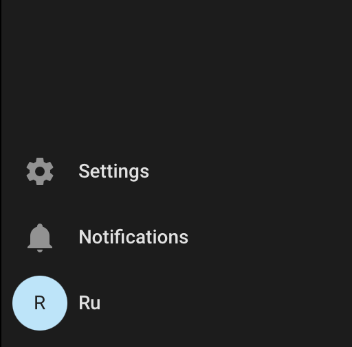
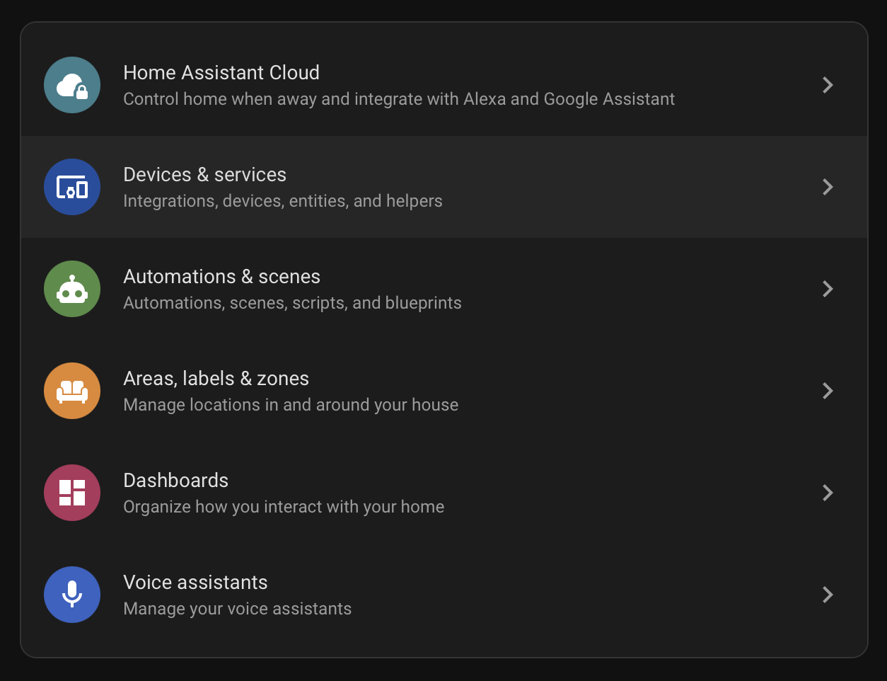
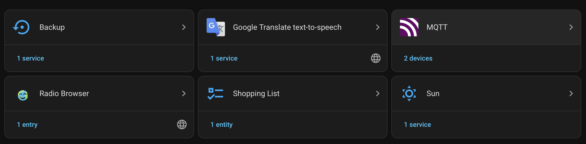
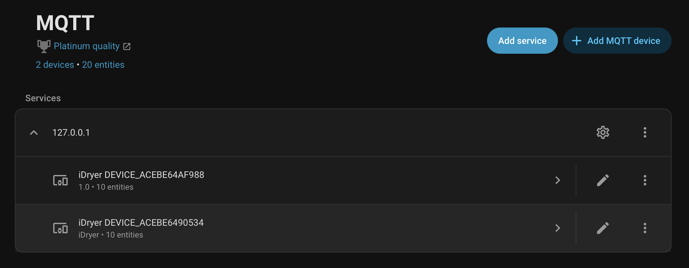
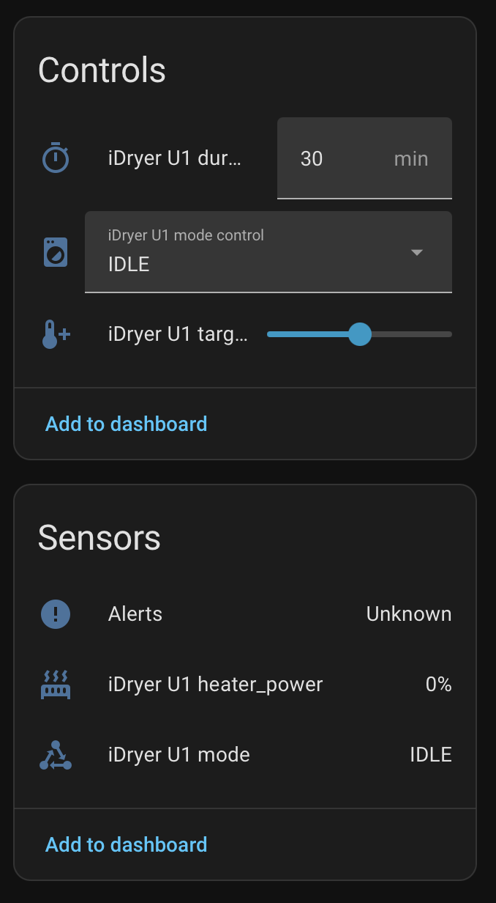

# Подключение iHeater Link к Home Assistant

iHeater Link публикует устройство в Home Assistant через MQTT Discovery: HA автоматически создаёт карточку с реальными сенсорами и элементами управления (целевая температура, длительность, режим IDLE/DRYING/STORAGE).

!!! note
    Устройство **не появится** в `Settings → Devices & services → Discovered`. iHeater Link использует MQTT Discovery, а не UPnP/zeroconf. В Home Assistant должна быть **уже добавлена** интеграция **MQTT**, указывающая на ваш брокер.

## Что должно быть готово

1. MQTT-брокер (например Mosquitto add-on) запущен в HA или доступен по сети.
2. В HA добавлена интеграция **MQTT** с настроенным брокером.
3. iHeater Link через портал получил команду `link_integration {type:"ha"}` и установил соединение с тем же брокером.

## Шаг 1. Открыть настройки

В боковом меню Home Assistant внизу нажмите **Settings**.

## Шаг 2. Перейти в Devices & services

В списке разделов настроек выберите **Devices & services**.

## Шаг 3. Открыть интеграцию MQTT

В списке интеграций найдите карточку **MQTT**. Под названием — счётчик подключённых устройств.

## Шаг 4. Найти устройство iDryer

На странице интеграции в разделе **Services** разверните узел брокера (`127.0.0.1` или адрес вашего брокера). Под ним перечислены iDryer-устройства с их серийными номерами вида `DEVICE_*`.

Кликните по нужному устройству.

## Шаг 5. Управление и состояние

На странице устройства два блока:

- **Controls** — управляющие элементы:
  - `iDryer U1 duration` — длительность в минутах
  - `iDryer U1 mode control` — режим (`IDLE` / `DRYING` / `STORAGE`)
  - `iDryer U1 target temp` — целевая температура (ползунок)
- **Sensors** — реальные значения. Состав зависит от типа устройства (`Config` определяет публикуемые сенсоры):
  - iHeater Link: `heater_power`, `mode`, `alerts`
  - Storage Link: то же плюс `temperature`, `humidity`

Чтобы запустить нагрев:

1. Установите целевую температуру ползунком.
2. Установите длительность.
3. Выберите режим `DRYING` или `STORAGE` в селекторе.

Чтобы остановить — переключите селектор в `IDLE`.

!!! note
    Значения `target temp` и `duration` сначала сохраняются на устройстве как «отложенные», реальный старт происходит при выборе режима. Это позволяет задать параметры в любом порядке и стартовать одним действием.

## Что происходит под капотом

- **Discovery** (создание entity в HA UI с правильными иконками) — публикуется автоматически при подключении к HA-брокеру. Состав определяется флагами `Config.hasXxx` — отсутствующие сенсоры не появляются призраками.
- **State** (текущие значения) — публикуется в HA-топики каждые 5 секунд параллельно с публикацией в портал.
- **Команды** (`set_temp` / `set_duration` / `set_mode`) — идут от HA → MQTT-брокер → устройство → собираются в `Request` и проходят через тот же путь что команды портала. Никаких HA-специфичных веток в коде продукта.

## Диагностика

| Симптом | Что проверить |
|---------|---------------|
| Устройство не появляется в HA | На устройстве в портале — `Home Assistant → Включено: да`. Поле `ha.state` в `integrations/status` должно быть `online`. |
| Discovery опубликован, но карточка пустая | Подождите 5–10 секунд после первого подключения. Если значения не появились — проверьте что MQTT-брокер не теряет retained-сообщения. |
| Кнопки управления не реагируют | Проверьте `command_topic` из Discovery — топик должен совпадать с `idryer/{serial}/U1/set_mode` и т.д. |
| Призрачные сенсоры со значением Unknown | Старые retained Discovery от предыдущей версии прошивки. После обновления либо подождите следующий цикл публикации Discovery, либо очистите retained: `mosquitto_pub -t 'homeassistant/.../config' -n -r`. |
