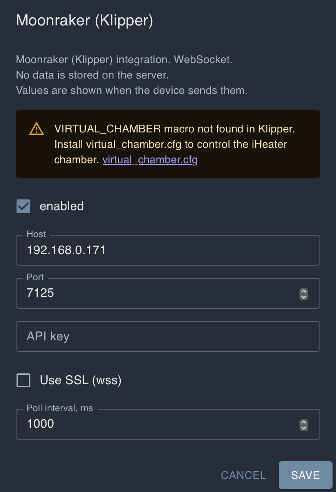

# Настройка Klipper для iHeater Link

## Для чего это нужно

Эта возможность предназначена для принтеров на Klipper с закрытой системой: Creality, Qidi, Flashforge и других современных моделей, где пользователь не может собрать и установить прошивку iHeater для прямой работы с Klipper.

Обычные файлы конфигурации Klipper и пользовательские G-code макросы при этом часто доступны. Поэтому iHeater Link использует более простой путь: он подключается к той же Wi-Fi сети, что и принтер, читает переменные пользовательского Klipper-макроса и передаёт целевую температуру контроллеру iHeater.

На стороне принтера нужно добавить только несколько G-code макросов. Они принимают стандартные команды температуры камеры `M141` и `M191` и сохраняют целевую температуру в `VIRTUAL_CHAMBER`.

Итоговая схема:

```text
Слайсер / G-code -> M141 S50 -> Klipper macro VIRTUAL_CHAMBER.target=50
                                      |
                                      v
Принтер в локальной сети <- Wi-Fi <- iHeater Link -> сигнальная линия -> iHeater
```

Пользователю не нужно получать root-доступ или вмешиваться во внутреннюю прошивку принтера. Достаточно иметь доступ к пользовательским макросам Klipper.

## Что получится

```text
M141 S50 -> target = 50 -> iHeater Link включает нагрев
M141 S0  -> target = 0  -> iHeater Link выключает нагрев
```

Многие современные принтеры уже имеют датчик температуры внутри камеры. Если такой датчик предусмотрен производителем и виден в конфигурации Klipper, его можно использовать для передачи фактической температуры в портал и iHeater Link. Если датчика нет, iHeater Link всё равно сможет управлять нагревом по целевой температуре.

## 1. Добавьте файл макросов

Создайте файл `virtual_chamber.cfg` в конфигурации Klipper и подключите его из `printer.cfg`:

```ini
[include virtual_chamber.cfg]
```

Содержимое `virtual_chamber.cfg`:

```ini
[gcode_macro VIRTUAL_CHAMBER]
variable_target: 0
variable_temperature: -1
variable_has_sensor: 0
gcode:

[gcode_macro M141]
gcode:
  {{ "" }}
  SET_GCODE_VARIABLE MACRO=VIRTUAL_CHAMBER VARIABLE=target VALUE={t}

[gcode_macro M191]
gcode:
  {{ "" }}
  SET_GCODE_VARIABLE MACRO=VIRTUAL_CHAMBER VARIABLE=target VALUE={t}

[gcode_macro CLEAR_VIRTUAL_CHAMBER]
gcode:
  SET_GCODE_VARIABLE MACRO=VIRTUAL_CHAMBER VARIABLE=target VALUE=0
  SET_GCODE_VARIABLE MACRO=VIRTUAL_CHAMBER VARIABLE=temperature VALUE=-1
  SET_GCODE_VARIABLE MACRO=VIRTUAL_CHAMBER VARIABLE=has_sensor VALUE=0
```

После сохранения перезапустите Klipper или выполните `RESTART`.

## 2. Опционально подключите датчик камеры

Откройте конфигурацию принтера и посмотрите, есть ли в ней объект, похожий на датчик температуры камеры. У разных производителей и сборок он может называться по-разному, например:

```ini
[temperature_sensor chamber]
```

```ini
[temperature_sensor enclosure]
```

```ini
[temperature_sensor chamber_temp]
```

```ini
[heater_generic chamber]
```

Если такой объект есть, можно передавать iHeater Link фактическую температуру. Добавьте в `virtual_chamber.cfg` блок ниже и замените `heater_generic chamber` на имя объекта из своей конфигурации:

```ini
[delayed_gcode UPDATE_VIRTUAL_CHAMBER_TEMP]
initial_duration: 1.0
gcode:
  {{ "" }}
  SET_GCODE_VARIABLE MACRO=VIRTUAL_CHAMBER VARIABLE=temperature VALUE={t}
  SET_GCODE_VARIABLE MACRO=VIRTUAL_CHAMBER VARIABLE=has_sensor VALUE=1
  UPDATE_DELAYED_GCODE ID=UPDATE_VIRTUAL_CHAMBER_TEMP DURATION=2.0
```

Например, если у вас датчик описан как `[temperature_sensor enclosure]`, строка чтения температуры должна ссылаться на `printer["temperature_sensor enclosure"].temperature`.

Если датчика нет или вы не уверены, пропустите этот шаг. Для управления нагревом достаточно `target`, который передают макросы `M141` и `M191`.

## 3. Включите Klipper-интеграцию в iHeater Link

В портале откройте устройство iHeater Link и нажмите **MOONRAKER** в блоке **Device Info**. В интерфейсе это название используется для Klipper-принтеров.


Затем нажмите иконку шестерёнки в карточке устройства, откройте настройки соединений и включите **MOONRAKER**.


Вернитесь к настройкам **MOONRAKER**, укажите IP-адрес принтера и сохраните настройки.




Обычно достаточно таких параметров:

- Host: IP-адрес принтера в локальной сети;
- Port: `7125`;
- API key: оставить пустым, если принтер его не требует;
- Use SSL (wss): выключено для обычного локального подключения;
- Poll interval: `1000`.

После сохранения iHeater Link начнёт читать `VIRTUAL_CHAMBER.target` из Klipper и передавать его в iHeater.

## 4. Ручное управление из портала

Нагрев можно включать и без слайсера: задайте температуру камеры в карточке устройства и нажмите **START**. В поле времени можно указать длительность нагрева в минутах. Если оставить время `0`, iHeater будет работать без ограничения по времени, пока вы не нажмёте **STOP** или не отправите команду выключения.


## 5. Проверьте работу макросов

В консоли Klipper выполните:

```gcode
M141 S50
```

iHeater Link должен получить `target=50` и включить нагрев iHeater.

Затем выполните:

```gcode
M141 S0
```

Target станет `0`, и iHeater Link выключит нагрев.

## 6. Настройте слайсер

Слайсеру не нужно знать о `VIRTUAL_CHAMBER`. Он должен отправлять стандартные команды температуры камеры:

- `M141 S{T}` — установить температуру камеры без ожидания;
- `M191 S{T}` — установить температуру камеры с ожиданием.

Макросы Klipper перехватят эти команды и запишут значение в `VIRTUAL_CHAMBER.target`.

### OrcaSlicer / Bambu Studio

Температура камеры задаётся в профиле филамента:

```text
Filament Settings -> Temperatures -> Chamber temperature
```

Например:

- ABS / ASA: `40-50 °C`;
- PLA: `0 °C`.

Проверьте начало G-code. Там должна появиться строка вида:

```gcode
M141 S45
```

### PrusaSlicer / SuperSlicer

Если в профиле есть поле температуры камеры, используйте его. Если поля нет, добавьте команду вручную в Start G-code:

```gcode
M141 S45 ; chamber temperature for this filament
```

## 7. Обязательно выключайте нагрев в конце печати

По окончании печати target не сбрасывается сам. Добавьте в End G-code:

```gcode
CLEAR_VIRTUAL_CHAMBER
```

или:

```gcode
M141 S0
```

Это сбросит `VIRTUAL_CHAMBER.target` в `0`, после чего iHeater Link выключит iHeater.
